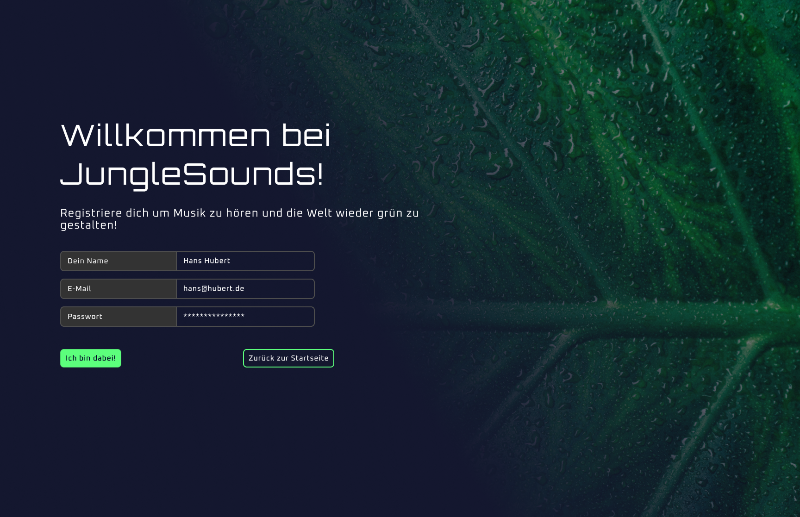
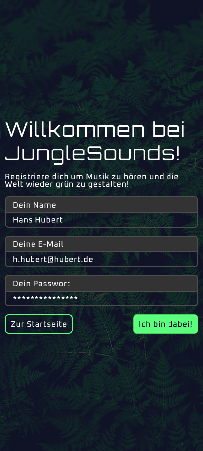
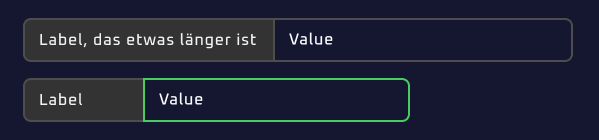
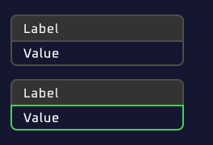
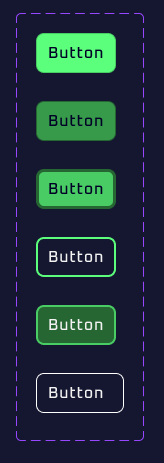

# Erste Seite: Registrierungsformular
_"Nun aber mal ins eingemachte. Bau zuerst eine Registrierungs-Seite über der sich unsere Nutzer später anmelden können. Achte hierbei nur darauf, dass es gut aussieht. Wir werden später für die Demo mehr Seiten erstellen und diese dann kurzerhand verlinken!"_

## Seite und Markup
Die Seite soll unter der url "/register" Aufrufbar sein.
Die Seite soll in 2 größen Implementiert werden: Mobile (Portrait) und Desktop (Landscape). Verwende hierfür den gleichen Breakpoint, der bereits für die Unterscheidung der font-sizes in `.h1` verwendet wurde.

### Style-Hinweise:
* Es gibt eine Überschrift "Willkommen bei SoundJungle!". Diese ist als `h1` gestyled.
* Der Text unter der Überschrift (Registriere dich um Musik zu hören und die Welt wieder grün zu gestalten!) ist als `body-l` gestyled.
* Alle restlichen Texte sind als `body-m` gestyled.
* Im Viewport für Desktops ist das entsprechende Hintergrundbild zu setzten. Darüber hinaus wird darüber nochmals ein Farbverlauf gelegt. Die Farbe für den Gradienten ist die CSS-Farbe `bg` und faded ins transparente aus.
* Im Viewport für mobile Geräte wird das entsprechende Hintergrundbild verwendet. Zusätzlich wird ein einheitliches Overlay darüber gelegt (#14172FCC).
* Der eigentliche Inhalt wird in einem Grid dargestellt und die Elemente haben einen Abstand von 2 rem zueinander (h1, body, form). Auf dem Desktop befindet sich der content zentriert auf der y-Achse und hat einen Abstand zur linken Kante mit 5%.
* Die Form-Elemente befinden sich in einem eigenen Grid. Eingabefelder sind haben einen gap von 1 rem zueinander.
* Unter den Eingabefeldern befinden sich 2 Buttons, einer um später zurück zur Startseite zu kommen, der andere um die Registrierung abzuschließen.

## Eingabe-Elemente
Eingabe-Elemente (inputs) sind in einem grid mit ihrem Label angeordnet.
Das Layout sieht auf großen Bildschirmen ein 2-spaltiges Setup vor (nebeneinander), auf kleinen Bildschirmen ein einspaltiges (untereinander).  
Das Design sieht dann entsprechend vor, dass sich das Label und sein Eingabefeld berühren und "einheitlich" aussehen. Dabei ist gemeint, dass an den Berührungspunkten kein radius an den ecken gesetzt wird, nur an den äußeren Ecken, die sich nicht berühren (vgl Screenshots).  
Ist das Eingabe-Element (input) aktiv, ändert sich dessen Border-Color (nicht aber die des Labels).

* Im inaktiven Zustand ist die Border-Color `mono-30`, im aktiven (fokusierten) Zustand ändert sicher dieser Wert auf `primary-40`. Die Hintergrundfarbe sollte entweder transparent oder `bg` sein, je nachdem ob der Hintergrund heller ist oder nicht.
* Der Hintergrund des Labels ist immer `mono-20`, die border-farbe `mono-30`.
* Border-Radius beträgt 8px.
* Der Text hat zum rand nach oben und unten 8px abstand, zum linken und rechten rand 16px.
* Die Label Breite soll bei untereinander liegenden Elementen gleichgestellt werden können.

## Buttons
Als letztes Element gibt es Buttons. Diese können in 2 Variationen auftreten: Primär und Sekundär.
Der primäre Button wird als Call-To-Action verwendet, der sekundäre als alternative Aktion.
Buttons haben 3 Zustände: `Default`, `hovered` bzw `focused` und `active`.

|Variante |Zustand|color     |bg-color   |border-color|
|-------- |-------|-----     |--------   |------------|
|Primary  |Default|bg        |primary-50 |primary-40  |
|Primary  |hovered|bg        |primary-30 |primary-20  |
|Primary  |active |bg        |primary-40 |primary-20  |
|Secondary|Default|mono-100  |transparent|primary-50  |
|Secondary|hovered|mono-100  |primary-20 |primary-40  |
|Secondary|active |mono-100  |transparent|primary-100 |

Die Klassen sollten auch auf alternative Element wie z.B. `a-tags` anwendbar sein.  
